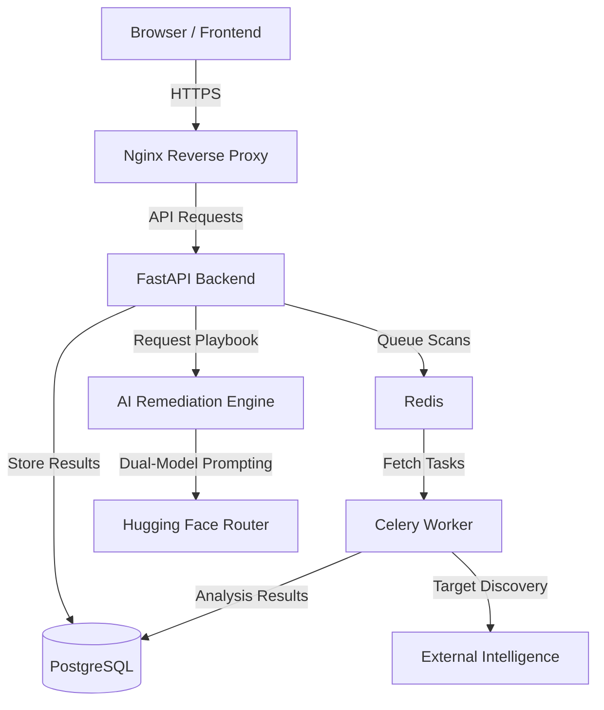

# 01 — System Architecture

QuantumShield is a high-performance, containerized security scanning platform designed specifically for the Post-Quantum (PQ) transition.

## High-Level Architecture

The system follows a modern microservices-adjacent architecture powered by Docker.

### Tech Stack
- **Frontend**: React 18 / Vite / Recharts (Responsive & Dynamic UI)
- **API Engine**: FastAPI / Pydantic (Asynchronous, Type-safe API)
- **Task Queue**: Celery / Redis (Reliable background scanning)
- **Persistence**: PostgreSQL / SQLAlchemy (Structured security data)
- **AI Engine**: Hugging Face / Qwen 2.5 & Llama 3.1 (Intelligent remediation playbooks)
- **Web Server**: Nginx (Load balancing & Static serving)

---

## ⚡ Parallel Scanning Engine

To support enterprise-scale infrastructure, QuantumShield uses a multi-tiered parallelism model.

### 1. Macro-Level (Worker Concurrency)
The Celery worker is configured with `--concurrency=4`. This allows the system to process **4 full organizations** simultaneously. Each worker process is an isolated instance capable of managing a complex scan workflow.

### 2. Micro-Level (Thread Pooling)
Inside each worker process, the Analysis Stage (`scan_tasks.py`) utilizes a `ThreadPoolExecutor` with `max_workers=5`. 
- When a scan discovers 50 subdomains, they are not scanned one-by-one.
- Instead, **5 domains are scanned concurrently** in the background.
- This prevents slow Nmap probes or TLS handshakes on a single domain from stalling the entire organizational report.

**Total System Throughput**: 4 Workers × 5 Threads = **20 concurrent domain analyses**.

---

## 🔒 Security Model (RBAC)

Documentation on the 5-role Role-Based Access Control system can be found in the [Developer Onboarding Guide](./07_DEVELOPER_ONBOARDING.md).
