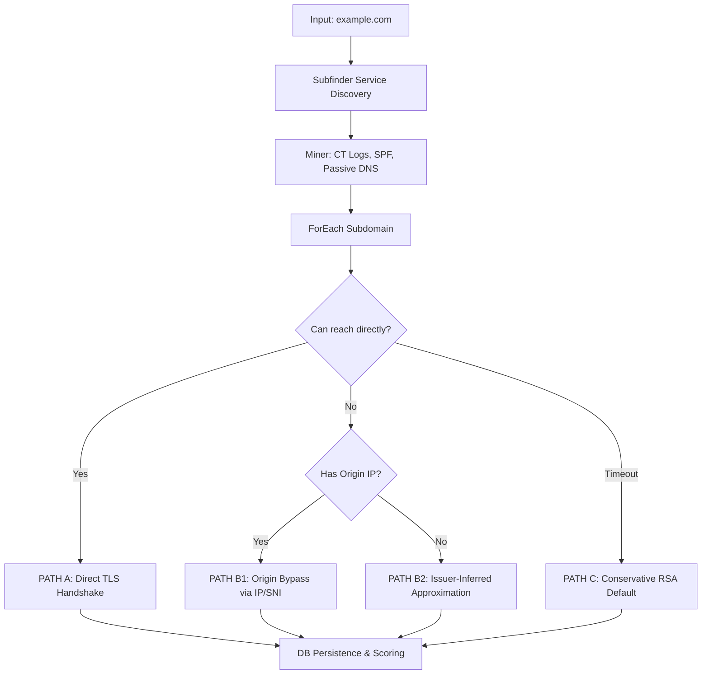

# 02 — The Scanning Brain: Multi-Path Pipeline

The most critical part of QuantumShield is its ability to accurately identify cryptographic settings, even when assets are hidden behind CDNs or Firewalls. This is achieved via a **Three-Path Decision Matrix**.

## The Execution Flow

---

##  The Three Paths

### PATH A: Direct Investigation (High Confidence)
If a domain is reachable on port 443 (or other TLS ports), the scanner performs a direct handshake using the **TLS Cascade**:
1. **SSLyze/TestSSL.sh**: Comprehensive cipher and protocol analysis.
2. **OpenSSL CLI**: Direct certificate extraction.
3. **Python SSL**: Low-level DER parsing for algorithm and key size.

### PATH B: Origin Bypass (Medium-High Confidence)
Used when a domain is behind a CDN (Cloudflare, Akamai). The scanner attempts to "pierce" the CDN to find the real origin certificate.
- **B1 (Targeted Bypass)**: If we found an origin IP in SPF records or Passive DNS, we connect to that IP while providing the domain name via SNI.
- **B2 (Intelligence Mining)**: If no origin IP is found, we use the `crt.sh` cache. We map the certificate issuer (e.g., "DigiCert SHA2 Secure Server CA") to its known default algorithm (RSA-2048) to provide a high-confidence approximation.

### PATH C: Deep Defense (Conservative)
If no network connection is possible and no historical logs exist, the scanner assumes a **Conservative Default (RSA-2048)**. This ensures that potentially high-risk assets are not "ignored" simply because they were firewalled during the scan window.

---

##  Strict Scope Discovery

QuantumShield enforces a **Strict Discovery Boundary** to prevent "Scope Bloat":
1. **Primary Source**: Subfinder — provides public-facing subdomains authorized for scanning.
2. **Support Source**: CT Logs (crt.sh) — used **strictly for IP intelligence**, not for adding new hostnames. This prevents internal hostnames accidentally leaked to CT logs from being targeted with active probes.
